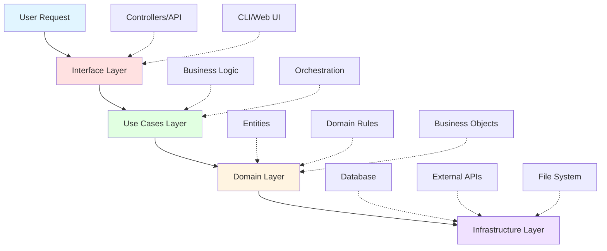

# 🏗️ PrompTitecture
> **Production-grade AI Architecture Framework**
> 
> Modular, executable architectures for building and deploying intelligent systems

[](https://opensource.org/licenses/MIT)
[](https://www.python.org/downloads/)
[](https://github.com/psf/black)

## 📖 Overview

PrompTitecture is a comprehensive framework for implementing production-ready AI architectures. It provides modular, battle-tested implementations of advanced AI patterns including Screaming Architecture principles.

## 🔊 Screaming Architecture

Screaming Architecture is a software design philosophy where the project structure immediately reveals its purpose and domain, rather than the frameworks or tools being used. The architecture "screams" what the application does.

### 🌊 BFS Layer Flow Diagram



### 📁 Recommended Folder Structure

```
prompTitecture/
├── docs/                          # Documentation
│   ├── architecture/              # Architecture diagrams and specs
│   ├── guides/                    # User guides and tutorials
│   └── api/                       # API documentation
│
├── src/
│   ├── python/                    # Python implementation
│   │   ├── interface/            # Interface adapters
│   │   │   ├── api/              # REST API controllers
│   │   │   ├── cli/              # Command-line interface
│   │   │   └── web/              # Web UI controllers
│   │   │
│   │   ├── use_cases/            # Application business rules
│   │   │   ├── orchestration/   # Workflow orchestration
│   │   │   ├── validation/      # Input validation
│   │   │   └── transformation/  # Data transformation
│   │   │
│   │   ├── domain/               # Enterprise business rules
│   │   │   ├── entities/        # Core business entities
│   │   │   ├── repositories/    # Repository interfaces
│   │   │   └── services/        # Domain services
│   │   │
│   │   └── infrastructure/       # External interfaces
│   │       ├── database/        # Database implementations
│   │       ├── external_apis/   # Third-party API clients
│   │       └── file_system/     # File operations
│   │
│   └── javascript/               # JavaScript implementation
│       ├── interface/
│       ├── use_cases/
│       ├── domain/
│       └── infrastructure/
│
├── tests/
│   ├── unit/                     # Unit tests
│   │   ├── python/
│   │   └── javascript/
│   ├── integration/              # Integration tests
│   └── e2e/                      # End-to-end tests
│
├── .github/
│   └── workflows/
│       ├── ci.yml               # Continuous integration
│       ├── cd.yml               # Continuous deployment
│       └── docs.yml             # Documentation deployment
│
├── examples/                     # Example implementations
├── scripts/                      # Build and deployment scripts
└── README.md                     # This file
```

### 🎯 Component Explanations

#### 1. **Interface Layer** (`src/{lang}/interface/`)
**Purpose:** Adapts external requests to internal use cases

- **API Controllers:** Handle HTTP requests, validate inputs, format responses
- **CLI:** Command-line interface for terminal operations
- **Web UI:** Frontend controllers and view logic

**Key Principles:**
- No business logic
- Thin adapter layer
- Framework-specific code isolated here
- Converts external formats to domain models

#### 2. **Use Cases Layer** (`src/{lang}/use_cases/`)
**Purpose:** Application-specific business rules and orchestration

- **Orchestration:** Coordinates multiple domain services
- **Validation:** Enforces application-level constraints
- **Transformation:** Prepares data for domain layer

**Key Principles:**
- Framework-agnostic
- Contains application flow logic
- Orchestrates domain entities
- Defines interfaces for infrastructure needs

#### 3. **Domain Layer** (`src/{lang}/domain/`)
**Purpose:** Core business logic and enterprise rules

- **Entities:** Core business objects with behavior
- **Repositories:** Interfaces for data persistence (no implementations)
- **Services:** Domain-specific operations that don't belong to entities

**Key Principles:**
- Zero external dependencies
- Pure business logic
- Framework-agnostic
- Most stable layer (changes least frequently)

#### 4. **Infrastructure Layer** (`src/{lang}/infrastructure/`)
**Purpose:** Technical implementations and external integrations

- **Database:** ORM implementations, queries, migrations
- **External APIs:** Third-party service clients
- **File System:** File I/O operations

**Key Principles:**
- Implements interfaces defined in domain/use cases
- Contains all framework-specific implementations
- Pluggable and replaceable
- Most volatile layer (changes most frequently)

### 🔄 Dependency Flow

```
Interface → Use Cases → Domain ← Infrastructure
                ↑                      ↑
                └──────────────────────┘
                (Dependency Inversion)
```

**Critical Rules:**
1. Dependencies point inward (toward domain)
2. Domain layer has ZERO dependencies
3. Infrastructure implements interfaces from inner layers
4. Use Dependency Injection for loose coupling

### 📊 Testing Strategy

#### Unit Tests (`tests/unit/`)
- Test individual components in isolation
- Mock external dependencies
- Fast execution (<1s per test)
- High coverage (>80%)

#### Integration Tests (`tests/integration/`)
- Test layer interactions
- Use test databases/services
- Verify data flow
- Medium execution time

#### E2E Tests (`tests/e2e/`)
- Test complete user workflows
- Use production-like environment
- Verify system behavior
- Slower execution

## 🚀 Getting Started

### Prerequisites
- Python 3.9+ or Node.js 16+
- Docker (optional, for containerized deployment)
- Git

### Installation

```bash
# Clone the repository
git clone https://github.com/GaboBase/promptitecture.git
cd promptitecture

# Python setup
cd src/python
python -m venv venv
source venv/bin/activate  # On Windows: venv\Scripts\activate
pip install -r requirements.txt

# JavaScript setup
cd src/javascript
npm install
```

### Running Tests

```bash
# Python tests
cd src/python
pytest tests/

# JavaScript tests
cd src/javascript
npm test
```

## 📚 Documentation

Comprehensive documentation is available in the `docs/` directory:

- [Architecture Guide](docs/architecture/README.md)
- [API Reference](docs/api/README.md)
- [User Guides](docs/guides/README.md)

View the live documentation at: [https://gabobase.github.io/promptitecture](https://gabobase.github.io/promptitecture)

## 🤝 Contributing

Contributions are welcome! Please read our [Contributing Guide](CONTRIBUTING.md) for details on:

- Code of Conduct
- Development process
- Pull request guidelines
- Coding standards

## 📄 License

This project is licensed under the MIT License - see the [LICENSE](LICENSE) file for details.

## 🌟 Features

- **Clean Architecture:** Separation of concerns with clear boundaries
- **Screaming Architecture:** Structure reveals intent
- **Framework Agnostic:** Core logic independent of frameworks
- **Test-Driven:** Comprehensive test coverage
- **Multi-Language:** Python and JavaScript implementations
- **CI/CD Ready:** GitHub Actions workflows included
- **Documentation:** Auto-generated docs with GitHub Pages

## 📞 Support

- **Issues:** [GitHub Issues](https://github.com/GaboBase/promptitecture/issues)
- **Discussions:** [GitHub Discussions](https://github.com/GaboBase/promptitecture/discussions)
- **Email:** support@promptitecture.dev

## 🗺️ Roadmap

- [ ] Complete Python implementation
- [ ] Complete JavaScript implementation
- [ ] Add example applications
- [ ] CLI tool for scaffolding
- [ ] Docker compose templates
- [ ] Integration with popular AI services
- [ ] Performance benchmarks
- [ ] Video tutorials

---

**Built with ❤️ by the PrompTitecture Team**
